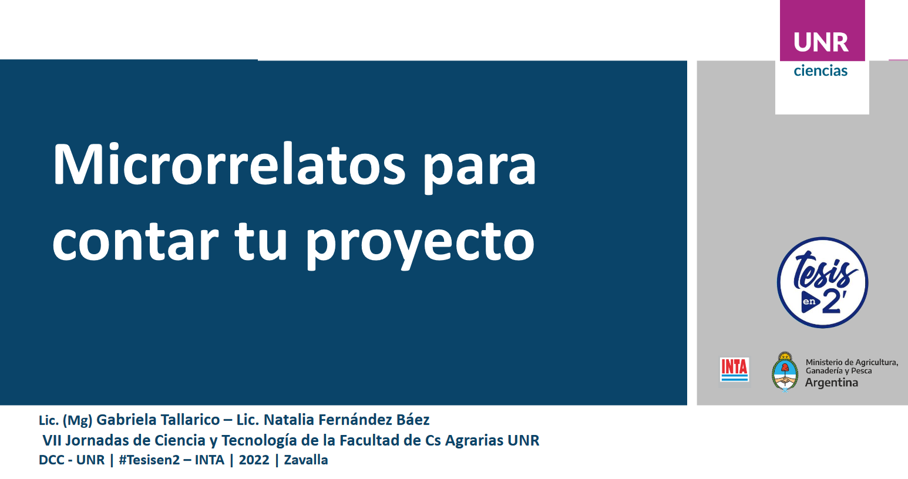

# Taller de microrrelatos

## Microrrelato

https://user-images.githubusercontent.com/87764919/177043188-a8591c1b-243b-458d-92d5-8bc816e86a51.mp4

## 5 etapas  

1) Problema: poca diversidad de tomate en el mercado y queja del consumidor acerca de la mala calidad y el poco sabor. 

2) Saberes: genética y mejoramiento de tomate.

3) Diferencial: especies silvestres de tomate.

4) Solución: desarrollo de variedades de calidad mejorada adaptadas a las condiciones de cultivo de la región.

5) Equipo: estudiantes, becarios e investigadores IICAR-CONICET-UNR.

## Guion

### Camara  
- Presentacion
- Imagenes representativas 
- Poco texto 
- Captura tipo selfie
- Uso de chroma para quitar fondo
- Buena iluminacion

### Audio
- Microfono PC  
NOTA: debería mejorar el audio.

### Texto
- Script relatado en primera persona, a cámara

## Recursos usados

 

-	Canva: diapositivas y edición  
Es una plataforma web con versión gratuita muy completa, muy intuitiva y utilizada. Tiene la ventaja de no necesitar ninguna instalación. Se puede desde armar diapositivas y grabarse proyectándolas, descargar en formato video y luego editarlo desde la misma plataforma. Existe la posibilidad de recorte, filtros, transiciones, plantillas de texto, superposición de imágenes, música, entre otras.

- OBS: grabación de pantallas  
Es una software libre que sirve para la grabación y transmisión de video por streaming.

### ¿Querés saber más?

[Web: **codigotomate.com.ar**](codigotomate.com.ar/)  
[Instagram: **@codigo.tomate**](https://www.instagram.com/codigo.tomate/)  
[Youtube: **Codigo Tomate**](https://www.youtube.com/channel/UCewqaLKn7Iu5RVPJOGBKOiQ)  
