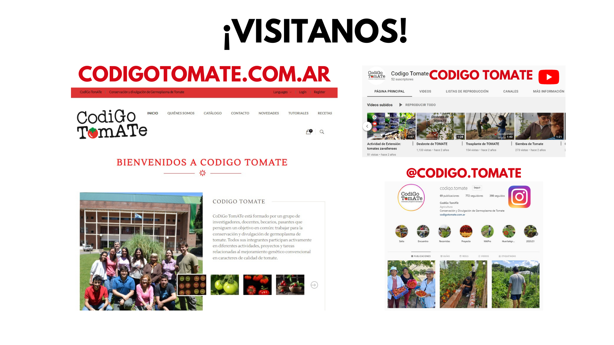

# Taller de microrrelatos

## Resources Used

 

## Guion

### Camara  
- Presentacion
- Imagenes representativas 
- Poco texto 
- Captura tipo selfie
- Uso de chroma para quitar fondo
- Buena iluminacion.

### Audio
- Microfono computadora  
NOTA: debería mejorar el audio.

### Texto
- En primera persona, a cámara.

## 5 etapas  

1) Problematica. Llamado a pensar de la audiencia. Lo poco que se conoce y la poca diversidad que se encuentra en el mercado del tomate en fresco. La queja del consumidor acerca del poco sabor.

2) ¿Qué invetigamos? Objetivos del grupo de trabajo: mejorar la calidad de fruto.

3) Diferencial. ¿Cómo lo hacemos? Hacer hincapié en las especies silvestres.

4) Solución. Variedades desarrolladas, seleccionadas y logros.

5) Presentacion del equipo.

