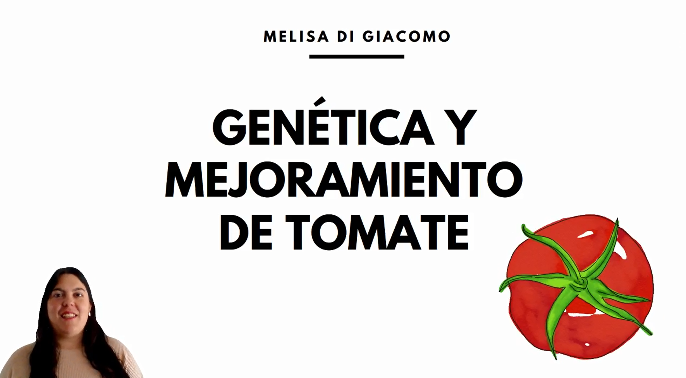

# Taller de microrrelatos

## Microrrelato

## 5 etapas  

1) Problema: poca diversidad de tomate en el mercado y queja del consumidor acerca de la mala calidad y el poco sabor. 

2) Saberes: genética de tomate.

3) Diferencial: especies silvestres de tomate.

4) Solución: desarrollo de variedades de calidad mejorada adaptadas a las condiciones de cultivo de la región.

5) Equipo: estudiantes, becarios e investigadores IICAR-CONICET-UNR

## Guion

### Recursos usados

 

### Camara  
- Presentacion
- Imagenes representativas 
- Poco texto 
- Captura tipo selfie
- Uso de chroma para quitar fondo
- Buena iluminacion.

### Audio
- Microfono computadora  
NOTA: debería mejorar el audio.

### Texto
- En primera persona, a cámara.

